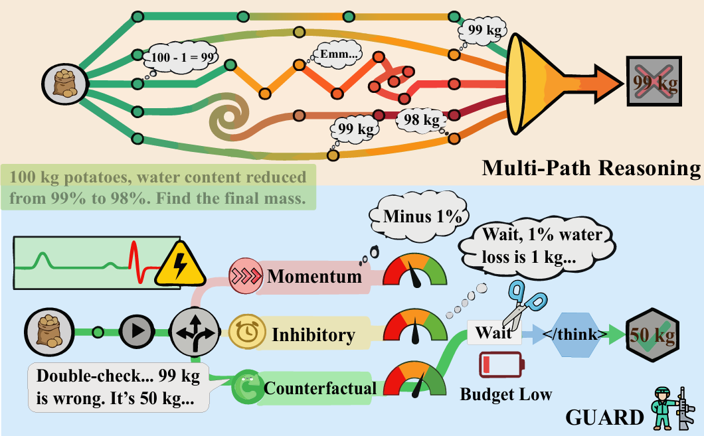

<p align="center">
  <h1 align="center"><strong>GUARD: Guided Uncertainty-Aware Reasoning with Decision Control</strong></h1>
</p>

---

## 🏠 About

This supplementary code repository implements **GUARD (Guided Uncertainty-Aware Reasoning with Decision Control)**, an adaptive inference-time framework for large language models. GUARD uses entropy monitoring at key decision points to trigger targeted branching search when the model exhibits high uncertainty, enabling more reliable and efficient reasoning.

<p align="center">
  
  <br>
  <em>Figure 1: Overview of the GUARD Inference Framework</em>
</p>

---
## 🛠️ Installation

Follow these steps to set up the environment:

1. **Create and activate the conda environment:**

```bash
conda create -n guard python=3.10
conda activate guard
```

2. **Install the required dependencies:**

```bash
cd eval/latex2sympy
pip install -e .
cd ../..
pip install -r requirements.txt 
pip install vllm==0.5.1 --no-build-isolation
pip install transformers==4.42.3
```

---

## 🎯 Quick Start

**Note:** We recommend running evaluation scripts with output redirection, for example:

```bash
nohup bash ./eval/script/run_guard.sh >> guard_eval.log 2>&1 &
```

### Reasoning Evaluation

We provide evaluation scripts for GUARD on various math and science benchmarks. You can use your own datasets in JSONL format or use publicly available benchmarks.

#### Key Hyperparameters

- `--entropy_quantile`: Entropy quantile threshold for triggering branching (default: 0.90)
- `--min_continuation_tokens`: Minimum remaining tokens for continuation after branching (default: 2000)
- `--branching_width`: Number of branches for local expansion (default: 3)
- `--branching_steps`: Number of tokens for each branch (default: 200)

#### Running Evaluation

1. **Edit the model path in the script:**

Open [eval/script/run_guard.sh](eval/script/run_guard.sh) and modify the `MODEL_NAME_OR_PATH` variable to point to your model:

```bash
MODEL_NAME_OR_PATH="/path/to/your/model"  # Change this to your model path
OUTPUT_DIR="/path/to/output/directory"     # Change this to your desired output directory
```

2. **Run the evaluation:**

```bash
cd eval
bash script/run_guard.sh
```

The script includes all key hyperparameters (`ENTROPY_QUANTILE`, `MIN_CONTINUATION_TOKENS`, `BRANCHING_WIDTH`, `BRANCHING_STEPS`) which you can also adjust in the script file.

### Code Generation Evaluation

1. **Edit the model path in the script:**

Open [eval/script/eval_guard_code.sh](eval/script/eval_guard_code.sh) and modify the model path and output directory.

2. **Run the evaluation:**

```bash
cd eval
bash script/eval_guard_code.sh
```

## 🔧 Code Structure

```
eval/
├── math_eval_guard.py              # GUARD evaluation for mathematical reasoning
├── code_eval_guard.py              # GUARD evaluation for code generation
├── data_loader.py                  # Dataset loading utilities
├── model_utils.py                  # Model loading and inference utilities
├── math_utils.py                   # Math answer extraction
├── parser.py                       # Output parsing utilities
├── trajectory.py                   # Trajectory tracking
├── python_executor.py              # Python code execution
├── script/
│   ├── run_guard.sh                        # Math evaluation script
│   └── eval_guard_code.sh                  # Code evaluation script
├── data/                           # Benchmark datasets
│   ├── example/                    # Example dataset
│   └── livecodebench_data/
└── latex2sympy/                    # Math answer extraction utilities
```

---

## 🙏 Acknowledgment

This repository builds upon the excellent open-source work of [AlphaOne](https://github.com/ASTRAL-Group/AlphaOne). Our code is developed based on their foundation with modifications to implement the GUARD framework. We sincerely thank the authors of AlphaOne for their contributions to the community.

---

## 📖 Citation

If you find our work useful in your research, please consider citing:

```bibtex
@misc{zhu2026dissecting,
      title={Dissecting Failure Dynamics in Large Language Model Reasoning}, 
      author={Wei Zhu and Jian Zhang and Lixing Yu and Kun Yue and Zhiwen Tang},
      year={2026},
      eprint={2604.14528},
      archivePrefix={arXiv},
      primaryClass={cs.AI},
      url={https://arxiv.org/abs/2604.14528}, 
}
```